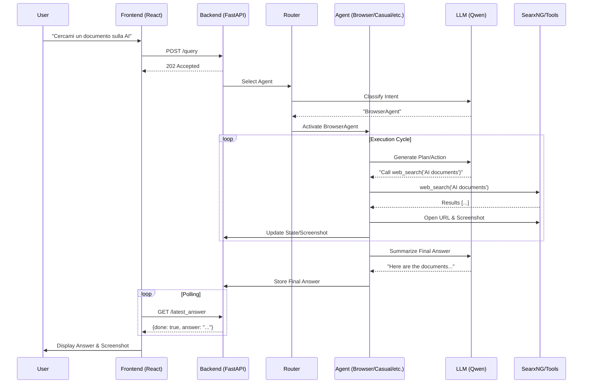

# Architecture & Sequence

This document describes the architecture and execution sequence of the **Agentic Local** system.

## System Overview

The system consists of three main components:
1. **Frontend**: React-based UI (Port 3000)
2. **Backend**: FastAPI server (Port 7777)
3. **SearxNG**: Meta-search engine (Port 8080)

## Directory Structure

```
/
├── api.py                  # Main Backend Entry Point
├── start_with_searxng.sh   # Startup Script
├── config.ini              # Configuration
├── sources/                # Core Logic
│   ├── agents/             # Agent Implementations (Casual, Browser, Coder, etc.)
│   ├── tools/              # Tools (Search, File Ops, Interpreters)
│   ├── router.py           # Agent Selection Logic
│   ├── llm_provider.py     # LLM Integration (Qwen, HF, etc.)
│   ├── memory.py           # Long-term Memory Management
│   └── browser.py          # Selenium Browser Control
├── frontend/               # React UI
└── tests/                  # Unit Tests
```

## Execution Sequence (Flow)

### 1. Startup Phase
1. **SearxNG** starts (Docker).
2. **Backend (api.py)** starts:
   - Loads configuration (`config.ini`).
   - Initializes `Provider` (LLM connection).
   - Initializes `Browser` (Selenium).
   - Initializes `Agents` (Casual, Browser, Coder, File, Planner).
   - Initializes `Interaction` manager.
3. **Frontend** starts (`npm start`).

### 2. Query Processing Phase
When a user sends a message ("Cercami un documento sulla AI"):

1. **Frontend** sends POST `/query` to Backend.
2. **Backend** (`process_query`):
   - Checks `is_generating` flag.
   - Starts background task (`run_query_in_background`).
   - Returns 202 Accepted immediately.
3. **Background Task**:
   - Calls `Interaction.think()`.
   - **Agent Router** analyzes query intent.
   - **Selection**: Selects appropriate agent (e.g., `BrowserAgent`).
4. **Agent Execution** (`BrowserAgent.process()`):
   - **Memory**: Retrieves context.
   - **Tool Usage**: Calls `web_search` (via SearxNG).
   - **Browser**: Navigates to URLs, takes screenshots.
   - **LLM**: Synthesizes answer.
5. **Response Delivery**:
   - Frontend polls `/latest_answer`.
   - Backend returns partial/final answer + blocks (tool usage).
   - Frontend updates UI with answer and screenshot.

## Mermaid Schema

You can view this schema in any Mermaid-compatible viewer.



## Component Interaction

```mermaid
graph TD
    User[User] --> Frontend
    Frontend -- HTTP --> Backend
    Backend --> Router
    Router --> Agents
    
    subgraph Agents
        BrowserAgent
        CasualAgent
        CoderAgent
        FileAgent
        PlannerAgent
    end
    
    Agents --> Tools
    Agents --> LLM[LLM Provider (Qwen)]
    Agents --> Memory[Memory System]
    
    Tools --> SearxNG[SearxNG (8080)]
    Tools --> Selenium[Selenium Browser]
    Tools --> FileSystem[File System]
    
    Selenium --> Web[Internet]
```
