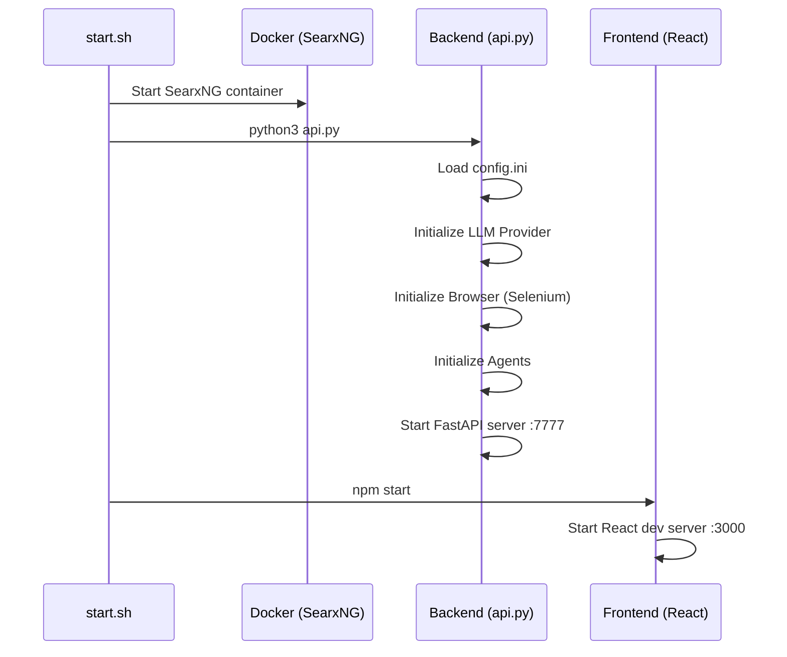
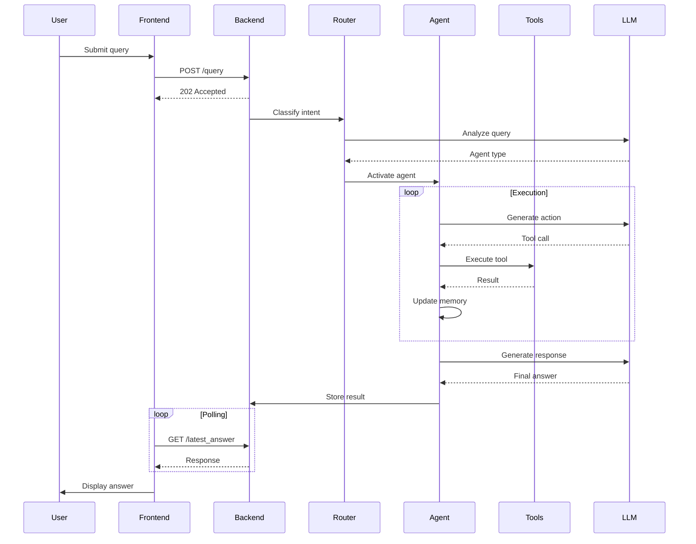
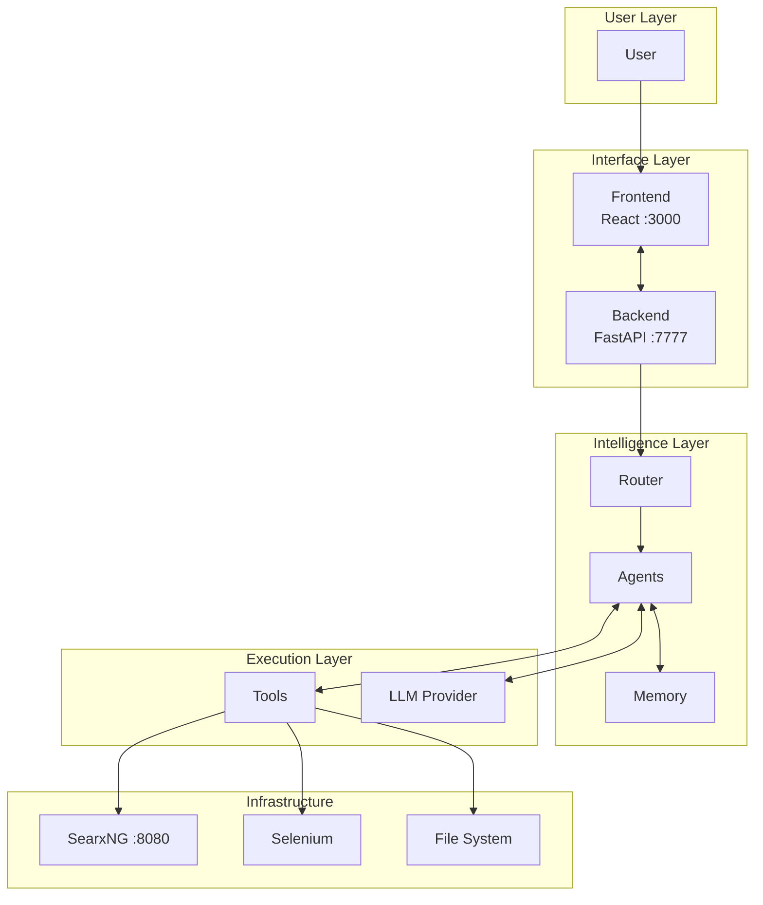

# Architecture & System Design

<p align="center">
  
</p>

---

## System Overview

Agentic is a multi-agent AI system composed of three main layers:

| Component | Port | Description |
|-----------|:----:|-------------|
| **Frontend** | 3000 | React-based web interface |
| **Backend** | 7777 | FastAPI server with agent orchestration |
| **SearxNG** | 8080 | Meta-search engine for web queries |

---

## Component Architecture

### Agent Layer

```
                    ┌─────────────────┐
                    │     Router      │
                    │ (Intent Class.) │
                    └────────┬────────┘
                             │
        ┌────────────────────┼────────────────────┐
        │          │         │         │          │
        ▼          ▼         ▼         ▼          ▼
   ┌─────────┐ ┌─────────┐ ┌─────────┐ ┌─────────┐ ┌─────────┐
   │ Casual  │ │ Browser │ │  Coder  │ │  File   │ │ Planner │
   │  Agent  │ │  Agent  │ │  Agent  │ │  Agent  │ │  Agent  │
   └─────────┘ └─────────┘ └─────────┘ └─────────┘ └─────────┘
        │          │         │         │          │
        └──────────┴────┬────┴─────────┴──────────┘
                        │
                        ▼
                  ┌───────────┐
                  │   Tools   │
                  └───────────┘
```

### Agent Responsibilities

| Agent | Role | Tools |
|-------|------|-------|
| **CasualAgent** | Conversation, Q&A | None |
| **BrowserAgent** | Web search, navigation | WebSearch, Selenium |
| **CoderAgent** | Code execution | Python, Bash, C, Go, Java, FileFinder |
| **FileAgent** | File operations | FileFinder, Bash |
| **PlannerAgent** | Task orchestration | Coordinates all agents |

---

## Execution Flow

### 1. Startup Sequence



### 2. Query Processing



---

## Directory Structure

```
agentic/
│
├── api.py                      # Main entry point
├── cli.py                      # CLI interface
├── config.ini                  # Configuration
│
├── sources/
│   │
│   ├── agents/
│   │   ├── agent.py            # Base Agent class
│   │   │   ├── memory          # Memory instance
│   │   │   ├── tools           # Available tools
│   │   │   ├── llm_request()   # LLM communication
│   │   │   └── execute_modules()
│   │   │
│   │   ├── casual_agent.py     # Conversational agent
│   │   ├── browser_agent.py    # Web navigation agent
│   │   ├── code_agent.py       # Code execution agent
│   │   ├── file_agent.py       # File operations agent
│   │   └── planner_agent.py    # Orchestration agent
│   │
│   ├── tools/
│   │   ├── tools.py            # Base Tool class
│   │   │   ├── tag             # Block identifier
│   │   │   ├── execute()       # Run the tool
│   │   │   └── load_exec_block()
│   │   │
│   │   ├── PyInterpreter.py    # Python execution
│   │   ├── BashInterpreter.py  # Shell commands
│   │   ├── fileFinder.py       # File search & read (PDF support)
│   │   ├── searxSearch.py      # Web search via SearxNG
│   │   ├── C_Interpreter.py    # C compilation
│   │   ├── GoInterpreter.py    # Go execution
│   │   └── JavaInterpreter.py  # Java execution
│   │
│   ├── router.py               # Agent routing logic
│   ├── llm_provider.py         # LLM provider abstraction
│   ├── memory.py               # Conversation memory
│   ├── browser.py              # Selenium wrapper
│   └── interaction.py          # Main orchestrator
│
├── prompts/
│   └── base/
│       ├── casual_agent.txt
│       ├── browser_agent.txt
│       ├── coder_agent.txt
│       ├── file_agent.txt
│       └── planner_agent.txt
│
├── frontend/
│   └── jarvis-ui/              # React application
│       ├── src/
│       │   ├── App.js
│       │   └── components/
│       └── package.json
│
├── llm_router/                 # Intent classifier model
│
└── conversations/              # Saved session data
```

---

## Data Flow

### Memory System

```
┌─────────────────────────────────────────┐
│                Memory                    │
├─────────────────────────────────────────┤
│  [system]  │  Agent prompt              │
│  [user]    │  User message 1            │
│  [assistant]│  Agent response 1         │
│  [user]    │  Tool feedback             │
│  [user]    │  User message 2            │
│  [assistant]│  Agent response 2         │
│  ...       │  ...                       │
└─────────────────────────────────────────┘
```

### Tool Execution Pattern

```python
# Agent generates response with code block
answer = """
I'll read that file for you.

```file_finder
action=read
name=document.pdf
```
"""

# Tool extracts and executes block
blocks, path = tool.load_exec_block(answer)
# blocks = ["action=read\nname=document.pdf"]

result = tool.execute(blocks)
# result = "--- Page 1 ---\nContent..."

# Feedback added to memory
memory.push('user', f"File Finder Results:\n{result}")
```

---

## Component Interaction



---

## Configuration Reference

### config.ini

```ini
[MAIN]
is_local = True                          # Use local LLM
provider_name = qwen                     # LLM provider
provider_model = Qwen/Qwen2.5-7B-Instruct
provider_server_address = 127.0.0.1:5000 # For remote providers
agent_name = Agentic                     # Display name
recover_last_session = False             # Resume previous chat
save_session = True                      # Persist conversations
speak = False                            # Text-to-speech
listen = False                           # Speech-to-text
languages = en                           # Interface language

[BROWSER]
headless_browser = True                  # Run browser hidden
stealth_mode = False                     # Anti-detection
```

### Environment Variables

```bash
# Work directory for file operations
WORK_DIR=/path/to/workspace

# Optional: HuggingFace token for gated models
HF_TOKEN=your_token

# Optional: API keys for cloud providers
OPENAI_API_KEY=your_key
DEEPSEEK_API_KEY=your_key
```

---

## Supported File Types

The FileFinder tool supports:

| Type | Extension | Method |
|------|-----------|--------|
| Text | .txt, .md, .json, .yaml | Direct read |
| Code | .py, .js, .c, .go, .java | Direct read |
| PDF | .pdf | pypdf extraction |
| Binary | others | UTF-8 decode with fallback |

---

## API Reference

### POST /query

```json
{
  "query": "Search for Python tutorials",
  "agent": null
}
```

### GET /latest_answer

```json
{
  "done": true,
  "answer": "Here are the results...",
  "blocks": [
    {
      "code": "print('hello')",
      "output": "hello",
      "success": true,
      "tool": "python"
    }
  ],
  "agent": "browser_agent",
  "reasoning": "..."
}
```

### GET /screenshot

Returns the latest browser screenshot as PNG.

---

## Performance Notes

- **Memory Compression**: Optional summarization for long conversations
- **Tool Timeout**: Bash commands timeout after 300s by default
- **Retry Logic**: CoderAgent retries failed code up to 5 times
- **Async Processing**: All agent operations are non-blocking
