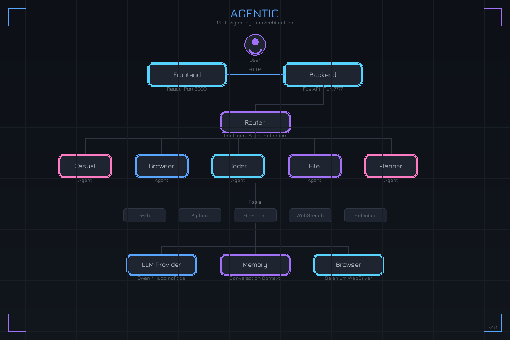

# Agentic

<p align="center">
  
</p>

<p align="center">
  <strong>A fully local multi-agent AI system</strong><br>
  Powered by Qwen running on your machine (M1/M2 Mac, CUDA GPU, or CPU)
</p>

---

## Overview

Agentic is an intelligent multi-agent system that automatically routes your requests to specialized agents. Each agent has unique capabilities and tools to handle different types of tasks.

| Agent | Purpose | Tools |
|-------|---------|-------|
| **Casual** | General conversation, Q&A | — |
| **Browser** | Web search and navigation | WebSearch, Selenium |
| **Coder** | Code generation and execution | Python, Bash, C, Go, Java |
| **File** | File operations | FileFinder, Bash |
| **Planner** | Multi-step task orchestration | Coordinates other agents |

## Quick Start

### Prerequisites

- Python 3.10+
- Node.js 18+
- Chrome browser
- 8GB+ RAM (16GB recommended)

### Installation

```bash
# Clone
git clone https://github.com/yourusername/agentic.git
cd agentic

# Python dependencies
pip install -r requirements.txt

# Frontend dependencies
cd frontend/jarvis-ui && npm install && cd ../..
```

### Running

**Complete Start** (with web search):
```bash
./start_with_searxng.sh
```

**Quick Start** (no search):
```bash
./start.sh
```

**Manual Start**:
```bash
# Terminal 1: Backend
python3 api.py

# Terminal 2: Frontend
cd frontend/jarvis-ui && npm start
```

Open **http://localhost:3000**

---

## Configuration

Edit `config.ini`:

```ini
[MAIN]
is_local = True
provider_name = qwen
provider_model = Qwen/Qwen2.5-7B-Instruct
agent_name = Agentic
save_session = True
speak = False
listen = False
languages = en

[BROWSER]
headless_browser = False
stealth_mode = False
```

### LLM Providers

| Provider | Model | Local |
|----------|-------|:-----:|
| `qwen` | Qwen2.5-7B-Instruct | ✓ |
| `huggingface-local` | Any HF model | ✓ |
| `ollama` | Any Ollama model | ✓ |
| `openai` | GPT-4, etc. | ✗ |
| `deepseek` | DeepSeek | ✗ |

---

## Project Structure

```
agentic/
├── api.py                  # FastAPI backend
├── cli.py                  # Command line interface
├── config.ini              # Configuration
│
├── sources/
│   ├── agents/             # Agent implementations
│   │   ├── agent.py        # Base agent class
│   │   ├── casual_agent.py
│   │   ├── browser_agent.py
│   │   ├── code_agent.py
│   │   ├── file_agent.py
│   │   └── planner_agent.py
│   │
│   ├── tools/              # Agent tools
│   │   ├── tools.py        # Base tool class
│   │   ├── PyInterpreter.py
│   │   ├── BashInterpreter.py
│   │   ├── fileFinder.py   # Supports PDF reading
│   │   └── searxSearch.py
│   │
│   ├── router.py           # Intelligent agent routing
│   ├── llm_provider.py     # LLM providers
│   ├── memory.py           # Conversation memory
│   ├── browser.py          # Selenium automation
│   └── interaction.py      # Orchestration
│
├── prompts/
│   └── base/               # Agent system prompts
│
├── frontend/
│   └── jarvis-ui/          # React web interface
│
└── conversations/          # Saved sessions
```

---

## API Endpoints

| Endpoint | Method | Description |
|----------|--------|-------------|
| `/query` | POST | Submit a task |
| `/latest_answer` | GET | Get agent response |
| `/screenshot` | GET | Browser screenshot |
| `/health` | GET | Health check |
| `/stop` | GET | Stop current task |

---

## Architecture

For detailed architecture diagrams and execution flow, see [ARCHITECTURE.md](ARCHITECTURE.md).

```
User Request
     ↓
  Router  →  Classifies intent
     ↓
  Agent   →  CasualAgent | BrowserAgent | CoderAgent | FileAgent | PlannerAgent
     ↓
  Tools   →  Python | Bash | FileFinder | WebSearch | Selenium
     ↓
   LLM    →  Generates response
     ↓
  Memory  →  Stores context
     ↓
 Response
```

---

## Features

- **Intelligent Routing**: Automatic agent selection based on task type
- **Multi-language Code Execution**: Python, Bash, C, Go, Java
- **PDF Support**: File agent can read and analyze PDF documents
- **Web Automation**: Selenium-based browsing with screenshot capture
- **Conversation Memory**: Context preserved across interactions
- **100% Local**: No API keys required with local LLM providers

---

## License

MIT License
