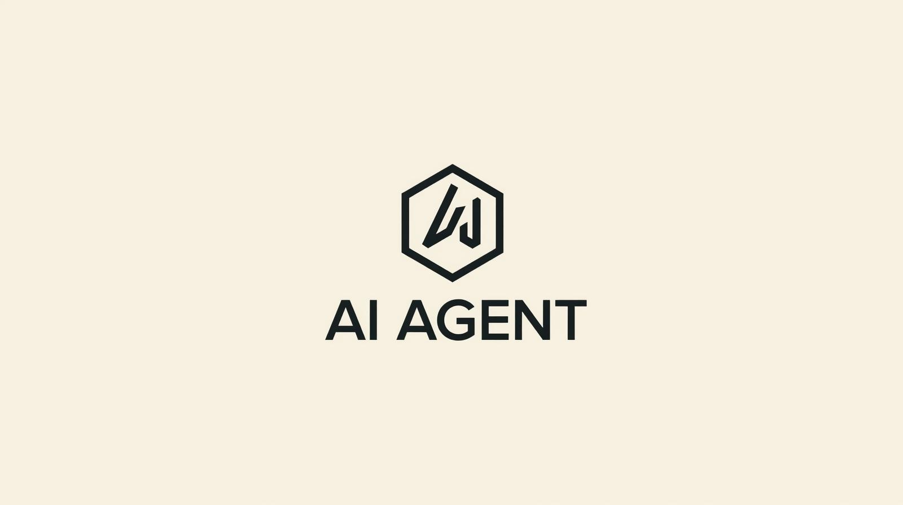

# Agentic Local - Multi-Agent System

<p align="center">
  
</p>

A fully local AI agent system powered by **Qwen3** running on your machine (M1/M2 Mac, CUDA GPU, or CPU).

## 📚 Architecture & Schema

For a detailed view of the system architecture, file structure, and execution sequence, please refer to [ARCHITECTURE.md](ARCHITECTURE.md).

## Features

- **6 Specialized Agents**: Casual, Browser, Coder, File, Planner, MCP
- **Intelligent Routing**: Automatic agent selection based on task type
- **Browser Automation**: Selenium-based web navigation
- **100% Local LLM**: Qwen3 running on HuggingFace Transformers (no API keys needed)
- **Modern Web UI**: React frontend with real-time updates

## Quick Start

### Prerequisites

- Python 3.10+
- Node.js 18+
- Chrome browser
- 8GB+ RAM (16GB recommended)

### Installation

```bash
# Clone the repository
git clone https://github.com/yourusername/agentic-local.git
cd agentic-local

# Install Python dependencies
pip install -r requirements.txt

# Install HuggingFace model dependencies
pip install transformers torch accelerate

# Install frontend dependencies
cd frontend/jarvis-ui
npm install
cd ../..
```

### Running

**Option 1: Complete Start (Recommended)**
Starts Backend, Frontend, and SearxNG (for web search).
```bash
./start_with_searxng.sh
```

**Option 2: Quick Start (No Search)**
```bash
./start.sh
```

**Option 3: Manual Start**
```bash
# Terminal 1 - Backend
python3 api.py

# Terminal 2 - Frontend
cd frontend/jarvis-ui
npm start
```

Open http://localhost:3000 in your browser.

## Configuration

Edit `config.ini`:

```ini
[MAIN]
is_local = True
provider_name = qwen
provider_model = Qwen/Qwen2.5-7B-Instruct
agent_name = Agentic
save_session = True
speak = False
listen = False
languages = en

[BROWSER]
headless_browser = False
stealth_mode = False
```

### Available Providers

| Provider | Model | Local |
|----------|-------|-------|
| `qwen` | Qwen/Qwen2.5-7B-Instruct | Yes |
| `huggingface-local` | Any HF model | Yes |
| `ollama` | Any Ollama model | Yes |
| `openai` | GPT-4, etc. | No |
| `deepseek` | DeepSeek | No |

### Environment Variables

```bash
# Optional: HuggingFace token for gated models
export HF_TOKEN="your_token_here"

# Optional: For cloud providers
export OPENAI_API_KEY="your_key"
export DEEPSEEK_API_KEY="your_key"
```

## Project Structure

```
.
├── api.py              # FastAPI backend
├── cli.py              # Command line interface
├── config.ini          # Configuration
├── sources/            # Core modules
│   ├── agents/         # Agent implementations
│   ├── tools/          # Agent tools
│   ├── llm_provider.py # LLM providers
│   ├── browser.py      # Browser automation
│   ├── router.py       # Agent routing
│   └── interaction.py  # Orchestration
├── frontend/           # React web UI
├── prompts/            # Agent system prompts
└── llm_router/         # Classifier model
```

## Agents

| Agent | Purpose |
|-------|---------|
| **CasualAgent** | General conversation |
| **BrowserAgent** | Web search and navigation |
| **CoderAgent** | Code generation and execution |
| **FileAgent** | File operations |
| **PlannerAgent** | Multi-step task planning |
| **MCPAgent** | MCP server integration |

## API Endpoints

| Endpoint | Method | Description |
|----------|--------|-------------|
| `/query` | POST | Submit a task |
| `/latest_answer` | GET | Get agent response |
| `/screenshot` | GET | Get browser screenshot |
| `/health` | GET | Health check |
| `/stop` | GET | Stop current task |

## License

MIT License
